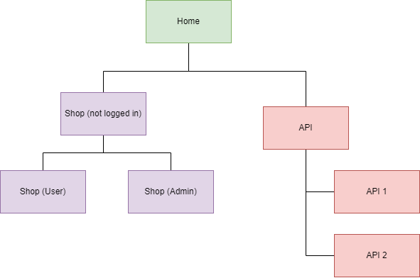
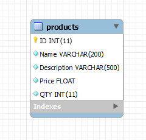

# Portfolio Website
I am working on this project for two main reasons. First to show off some coding skills I have learned so far. Secondly I wanted a project I could sink some time into over the summer, or really whenever I have free time.  

## Pages
Right now I have three main pages: Home, Shop and API.
* Home: pretty self explanatory, this will be the main and first page someone sees when visiting the website
* Shop: I wanted to make a list of products that you can purchase from a user account or update, delete or add products from an admin account.
* API: I wanted to test out some API's and this page is where i will do that.
## SiteMap

## Shop
For the database I am using MySQL workbench and MAMP to host a SQL database (locally)

EER Diagram for Products

